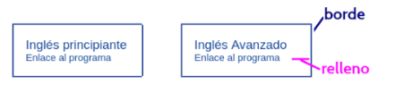

Consigna 
Interactuá con dos IAs distintas para generar el sitio web pedido y resolvé las siguientes consignas:

1. Armá el prompt con el que interactuarás con ambas IAs (debe ser el mismo en ambos casos).

2. Generá las dos versiones del sitio pedido y subilo a un repositorio git en dos directorios distintos: uno por cada versión.

3. Analizá ambos sitios con validadores de HTML, CSS y accesibilidad.

4. Generá un informe con el formato indicado y subilo, en formato PDF renombrando el documento como “informe_<APELLIDO> (ejemplo “Informe_BANCHOFF”),  a la tarea  TEORIA - ACT 1

**Enunciado 2**

Tenemos que generar un **sitio web estático** (sin scripts) para publicar cursos dictados por una institución X. El programa de los mismos se encuentran almacenados en archivos pdf. Para esto, hay que contemplar las siguientes condiciones:

1. Se debe mostrar una barra de navegación (dispuesta como más les guste) con enlaces a:
* información de contacto (un formulario simple con los datos que les parezcan más adecuados para esta sección);
* información de quien mantiene el sitio;
* catálogo de los cursos distribuido en 2 categorías: inglés y francés.

2. Pueden indicar los colores y estilos que prefieran.
3. Respecto a la interacción con el sitio, se debe poder elegir una categoría (ya sea desde una lista de opciones desplegable o radio buttons o la opción que refieran), y al seleccionar dicha categoría, mostrar los cursos asociados y un enlace para descargar el programa. **Siempre en forma estática.**
4. Respeto a lo pedido en la sección anterior, se debe mostrar por cada curso algo similar a lo siguiente, donde se especifica el tipo de **borde y relleno** (utilizando los valores que prefieran)

[Recuadro 1]

Inglés principiante

Enlace al programa

[Recuadro 2]

Inglés Avanzado

Enlace al programa

(El diagrama señala con flechas el borde exterior y el relleno interior de la tarjeta)

1. El sitio debe ser **responsivo**.
2. **Solo se debe usar HTML y CSS.**
3. Las reglas de estilo deben estar en un **archivo separado** denominado **estilosIA.css**.
4. Se debe trabajar con al menos 3 cursos por cada categoría a mostrar cuyos programas estarán en un directorio denominado "programas".